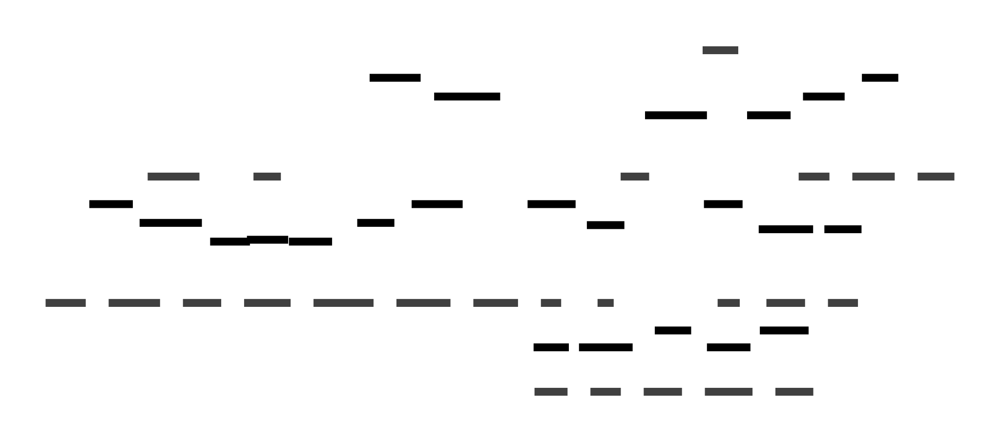

# 📘 High-Level Design (HLD) – Portfolio Website

## 📌 Objective:

Create a personal portfolio website to showcase profile, education, skills, projects, certifications, and contact details. The project is structured in a clean, modular, and scalable manner using HTML, CSS, and JavaScript, with vendor support (like Bootstrap, AOS, FontAwesome etc.).

---

## 🗂️ Folder Structure Overview:

```
📁 portfolio/
│
├── 📄 index.html          # Home page (landing page)
├── 📘 README.md           # Project documentation
├── ⚙️ .gitignore          # Git-ignored files config
│
├── 📁 pages/              # Individual section pages
│   ├── 📄 about.html
|   |── 📄 experience.html
│   ├── 📄 education.html
│   ├── 📄 skills.html
│   ├── 📄 projects.html
│   ├── 📄 certifications.html
│   └── 📄 contact.html
│
├── 📁 assets/             # Static content (CSS, JS, Images)
│   ├── 📁 css/
│   │   └── 🎨 style.css         # Custom styles
│   ├── 📁 js/
│   │   └── ⚙️ main.js           # Interactivity scripts
│   └── 📁 img/
│       ├── 🧑 profile.jpg       # Display picture
│       ├── 📄 skill-html.png    # Skill badge
│       └── 📄 cert-1.png        # Certification image
│
└── 📁 vendor/             # External libraries
    ├── 📦 Bootstrap/      # Bootstrap framework
    └── 📦 Others/         # AOS, FontAwesome, etc.
```

---

## 🧩 Component Description

| Component      | Description                                                         |
| -------------- | ------------------------------------------------------------------- |
| **index.html** | Main landing page with summary & navigation                         |
| **pages/**     | Contains different sections of the portfolio as separate HTML pages |
| **assets/**    | Organizes styling (CSS), scripts (JS), and images                   |
| **vendor/**    | Third-party libraries to enhance UI and animations                  |
| **README.md**  | Contains project goals, features, setup instructions                |
| **.gitignore** | Ensures certain files are not tracked by Git                        |

---

## 🧱 Technology Stack

| Layer        | Technology Used                          |
| ------------ | ---------------------------------------- |
| **Frontend** | HTML5, CSS3, JavaScript                  |
| **Styling**  | Bootstrap (via vendor), custom CSS       |
| **Icons/UI** | FontAwesome, AOS animations (via vendor) |
| **Hosting**  | GitHub Pages (planned deployment)        |

---

## 🔁 Navigation Flow

- **index.html** acts as the **home hub**, linking to:
  - About Me
  - Education
  - Skills
  - Projects
  - Certifications
  - Contact
- Navigation is consistent across all pages, using either:
  - a shared header/navigation bar
  - or duplicate nav sections on each page

---

## 📌 Highlights

- ✅ Clean modular structure (easy to scale or edit)
- ✅ Proper separation of concerns (HTML/JS/CSS)
- ✅ Ready for GitHub Pages deployment
- ✅ Vendor separation avoids clutter in `assets/`

---

## 📊 Visual Overview (Diagram)


